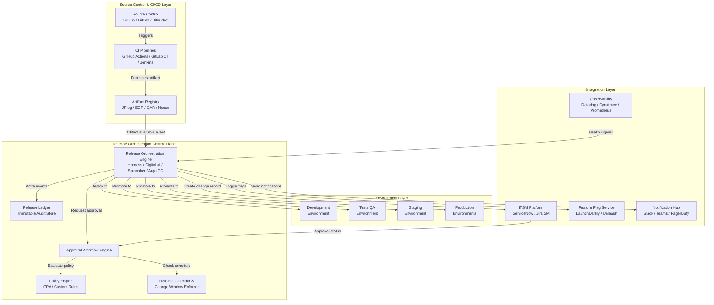
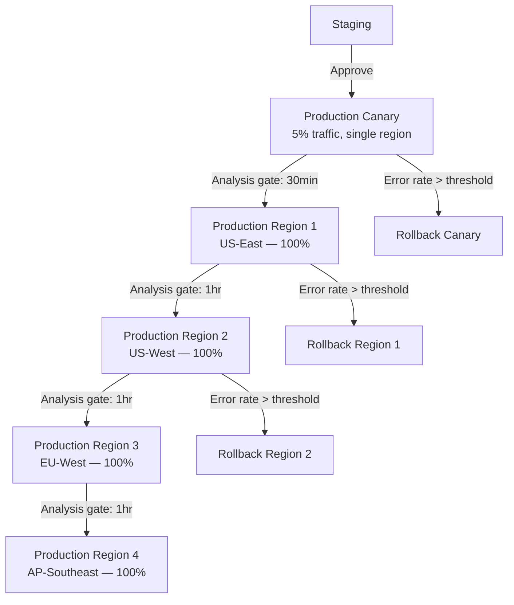
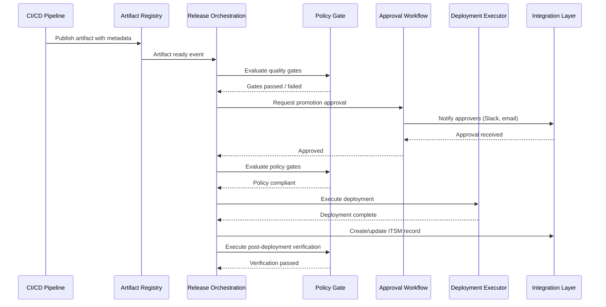
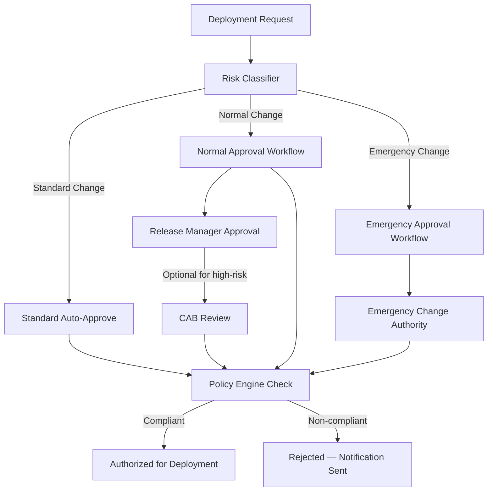
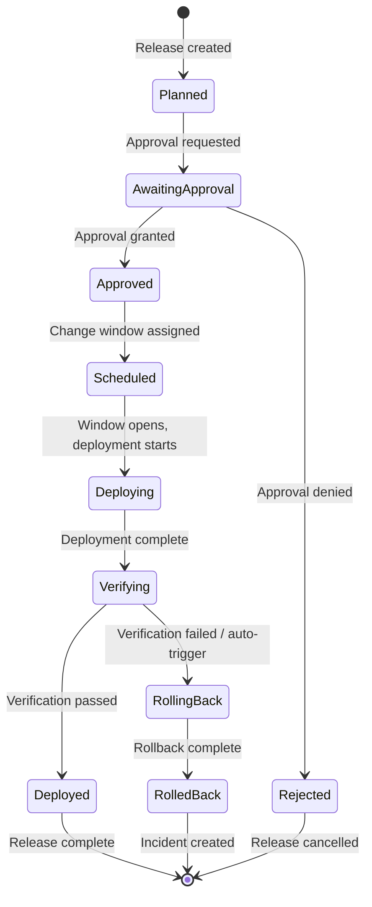
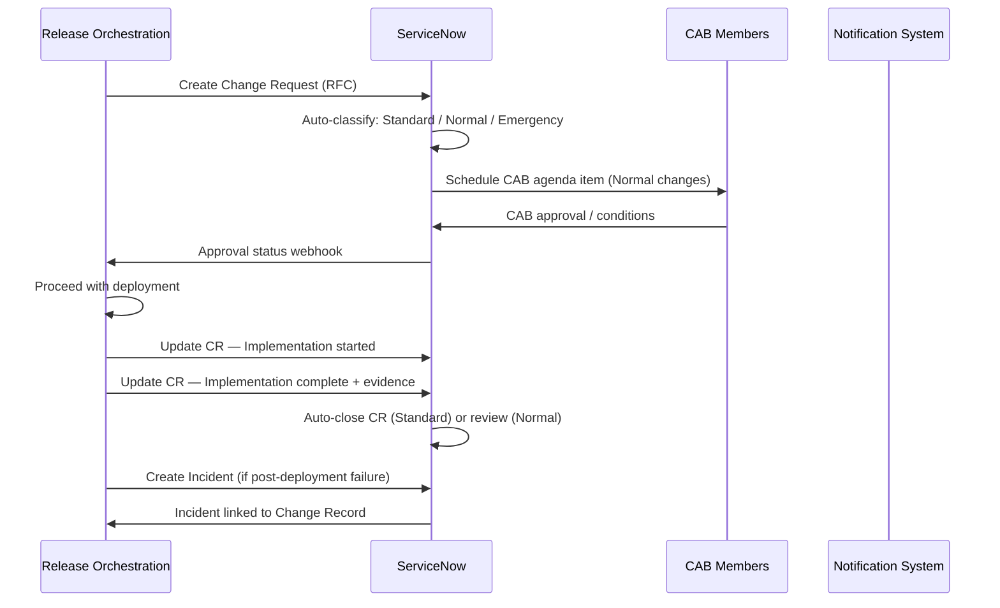
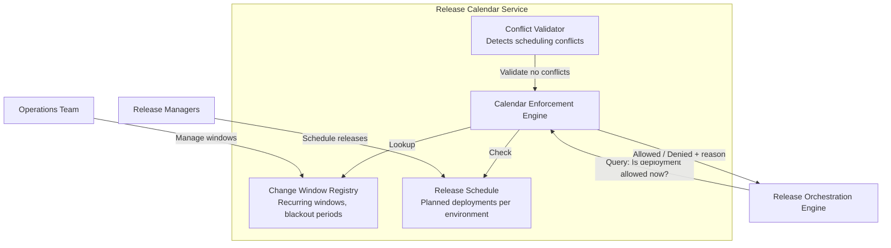
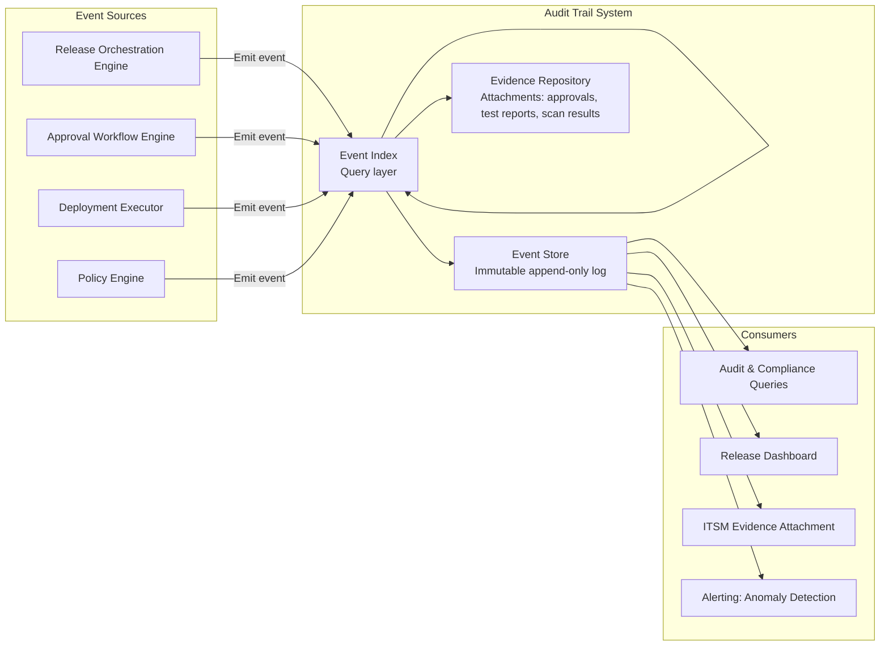

# Release Orchestration Reference Architecture

## Table of Contents

- [Overview](#overview)
- [High-Level Reference Architecture](#high-level-reference-architecture)
- [Multi-Environment Topology](#multi-environment-topology)
- [Environment Promotion Architecture](#environment-promotion-architecture)
- [Approval Workflow Engine Design](#approval-workflow-engine-design)
- [Orchestration Control Plane](#orchestration-control-plane)
- [Integration with CI/CD Tools](#integration-with-cicd-tools)
- [ITSM Integration Architecture](#itsm-integration-architecture)
- [Release Calendar System Design](#release-calendar-system-design)
- [Audit Trail Architecture](#audit-trail-architecture)

---

## Overview

The release orchestration reference architecture defines the structural components, interaction patterns, and integration points for an enterprise-grade release orchestration system. It is designed to be technology-agnostic at the pattern level while providing concrete implementation guidance for common tooling choices.

The architecture follows these design principles:

- **Separation of concerns** — the orchestration control plane is decoupled from CI/CD pipelines, deployment executors, and ITSM systems. Each layer has clear responsibilities and well-defined interfaces.
- **Policy as code** — approval policies, environment promotion rules, and deployment constraints are expressed as versioned, reviewable code, not locked in GUI configurations.
- **Immutable artifacts** — artifacts promoted through environments are never rebuilt. The same artifact that passed tests in staging is the one deployed to production.
- **Complete auditability** — every action taken by the orchestration system — approval, rejection, promotion, deployment, rollback — is recorded in an immutable audit log.
- **Defense in depth** — multiple independent enforcement points prevent unauthorized changes from reaching production, even if one layer is bypassed.

---

## High-Level Reference Architecture



---

## Multi-Environment Topology

A robust release orchestration system manages artifacts across a consistent, well-defined environment topology. The following represents the standard four-tier model, with notes on common variations.

### Standard Four-Tier Topology

```mermaid
graph LR
    subgraph DEV["Development (dev)"]
        D1[Service Replicas: 1]
        D2[Data: Synthetic]
        D3[External: Mocked]
    end
    subgraph TEST["Test / QA (test)"]
        T1[Service Replicas: 1-2]
        T2[Data: Anonymized Prod Copy]
        T3[External: Sandbox APIs]
    end
    subgraph STAGING["Staging (staging)"]
        S1[Service Replicas: Production-like]
        S2[Data: Production-mirror or anonymized]
        S3[External: Production APIs read-only]
    end
    subgraph PROD["Production (prod)"]
        P1[Service Replicas: Full HA]
        P2[Data: Live Production]
        P3[External: Production APIs]
    end

    DEV -->|Automated promotion| TEST
    TEST -->|Approval gate| STAGING
    STAGING -->|CAB + approval gate| PROD
```



### Environment Characteristics

| Characteristic | Dev | Test | Staging | Production |
|---|---|---|---|---|
| **Deployment trigger** | Automatic on merge to main | Automatic after dev validation | Manual approval required | Manual approval + CAB (normal changes) |
| **Approval requirements** | None | Automated quality gates | Tech lead or release manager | Release manager + optional CAB |
| **Data sensitivity** | Synthetic only | Anonymized | Anonymized or production-mirror | Live data |
| **External dependencies** | Mocked/stubbed | Sandbox / test accounts | Read-only production or sandbox | Full production |
| **Change window** | None | None | Soft window (business hours preferred) | Hard window enforced |
| **Rollback SLA** | Best effort | Best effort | 30 minutes | 15 minutes |
| **Monitoring level** | Basic | Standard | Full production-equivalent | Full with alerting |

### Multi-Region Production Topology

For organizations operating across multiple geographic regions, the production tier typically implements a sequential or parallel multi-region deployment pattern:



---

## Environment Promotion Architecture

Environment promotion is the controlled movement of an artifact from one environment to the next. The promotion architecture ensures that only validated, approved artifacts advance.

### Promotion Gate Model

Each promotion gate consists of three layers:

1. **Quality gates** — automated checks that must pass before promotion is considered (test results, coverage thresholds, security scan results, performance benchmarks)
2. **Policy gates** — policy engine evaluation of artifact metadata, approvals, and contextual factors (change window status, deployment risk score, dependency health)
3. **Approval gates** — human or automated approval based on the change classification and risk assessment



### Immutable Artifact Promotion

A critical architectural principle is that the same artifact (same digest, same immutable tag) is promoted through environments — never rebuilt. This ensures that:

- The artifact tested in staging is provably the same artifact deployed to production
- No build-time variation can introduce bugs between staging and production
- The chain of evidence from commit to production is unbroken

Implementation: artifacts are stored in a registry with content-addressable identifiers (SHA-256 digest for container images, artifact hash for packages). Promotion records in the orchestration system reference the artifact digest, not a mutable tag.

---

## Approval Workflow Engine Design

The approval workflow engine is the component responsible for routing deployment requests to the appropriate approvers and enforcing authorization requirements.

### Workflow Engine Architecture



### Risk Classification Model

The risk classifier assigns each deployment request to a change category based on configurable criteria:

| Factor | Low Risk | Medium Risk | High Risk |
|---|---|---|---|
| **Environment** | Dev, Test | Staging | Production |
| **Service criticality** | Non-critical | Business important | Business critical |
| **Change type** | Patch version, config | Minor version, dependency update | Major version, schema change, infra change |
| **Blast radius** | Single service | Multiple services | Platform/cross-cutting |
| **Prior incidents** | No incidents in 90 days | 1-2 incidents in 90 days | 3+ incidents in 90 days |
| **Change window** | — | Within window | Outside window requires emergency |

### Approval Policy Configuration

Approval policies are expressed as code (YAML or OPA Rego) and stored in version control:

```yaml
# approval-policy.yaml
policies:
  standard_change:
    criteria:
      - environment: [dev, test]
      - change_type: [patch, config_only]
      - risk_score: { max: 30 }
    approval:
      type: automatic
      required_gates:
        - ci_tests_passed
        - security_scan_clean
        - no_open_critical_vulnerabilities

  normal_change_staging:
    criteria:
      - environment: [staging]
      - risk_score: { min: 31, max: 70 }
    approval:
      type: manual
      approvers:
        groups: [release-managers, tech-leads]
      quorum: 1
      timeout_hours: 24
      escalation_after_hours: 8

  high_risk_production:
    criteria:
      - environment: [production]
      - risk_score: { min: 71 }
    approval:
      type: manual
      approvers:
        groups: [release-managers]
      quorum: 1
      additional_review:
        - type: cab
          required: true
      change_window_required: true
      timeout_hours: 48
```

---

## Orchestration Control Plane

The orchestration control plane is the central coordination component that manages the state of all in-flight releases.

### Control Plane Components

| Component | Responsibility |
|---|---|
| **Release State Machine** | Tracks lifecycle state of each release (planned, approved, deploying, deployed, verifying, complete, failed, rolled back) |
| **Environment Registry** | Maintains the current deployed state of all services across all environments |
| **Dependency Graph** | Models inter-service dependencies to enforce ordered deployments and coordinated rollbacks |
| **Deployment Executor** | Issues deployment commands to environment-specific deployment agents |
| **Health Monitor** | Evaluates post-deployment health signals and triggers automated actions |
| **Rollback Controller** | Executes rollback procedures when triggered by health monitors or manual action |

### Release State Machine



---

## Integration with CI/CD Tools

The release orchestration system integrates with CI/CD pipelines through well-defined event and API contracts.

### GitHub Actions Integration

```yaml
# .github/workflows/publish-and-register.yml
name: Build, Test, and Register Release

on:
  push:
    branches: [main]

jobs:
  build-and-test:
    runs-on: ubuntu-latest
    steps:
      - uses: actions/checkout@v4
      - name: Build and test
        run: make build test

      - name: Build container image
        run: |
          docker build -t $IMAGE_REGISTRY/$SERVICE_NAME:$GITHUB_SHA .
          docker push $IMAGE_REGISTRY/$SERVICE_NAME:$GITHUB_SHA

      - name: Run security scan
        uses: aquasecurity/trivy-action@master
        with:
          image-ref: ${{ env.IMAGE_REGISTRY }}/${{ env.SERVICE_NAME }}:${{ github.sha }}
          exit-code: '1'
          severity: 'CRITICAL,HIGH'

      - name: Register artifact with release orchestration
        uses: techstream/register-release-action@v2
        with:
          orchestration-url: ${{ secrets.RELEASE_ORCHESTRATION_URL }}
          api-token: ${{ secrets.RELEASE_ORCHESTRATION_TOKEN }}
          service-name: ${{ env.SERVICE_NAME }}
          artifact-type: container-image
          artifact-digest: ${{ steps.build.outputs.digest }}
          environment-target: dev
          ci-run-url: ${{ github.server_url }}/${{ github.repository }}/actions/runs/${{ github.run_id }}
          test-results-url: ${{ steps.test.outputs.results-url }}
```

### Integration Event Schema

All CI/CD tools communicate with the release orchestration system through a standardized event schema:

```json
{
  "event_type": "artifact_ready",
  "timestamp": "2024-03-15T14:32:00Z",
  "service": {
    "name": "payment-service",
    "team": "payments-platform",
    "tier": "business-critical"
  },
  "artifact": {
    "type": "container-image",
    "registry": "registry.example.com",
    "repository": "payment-service",
    "tag": "main-abc1234",
    "digest": "sha256:a3f8...",
    "build_url": "https://github.com/org/payment-service/actions/runs/123456"
  },
  "quality_gates": {
    "unit_tests": { "status": "passed", "coverage": 87.3 },
    "integration_tests": { "status": "passed" },
    "security_scan": { "status": "passed", "critical_vulnerabilities": 0, "high_vulnerabilities": 2 },
    "static_analysis": { "status": "passed" }
  },
  "target_environment": "dev",
  "git_context": {
    "commit_sha": "abc1234def5678",
    "branch": "main",
    "pr_url": "https://github.com/org/payment-service/pull/492"
  }
}
```

---

## ITSM Integration Architecture

Integration with ITSM platforms enables the release orchestration system to participate in formal change management processes.

### ServiceNow Integration Architecture



### Change Record Lifecycle Mapping

| Release Orchestration Event | ServiceNow Action |
|---|---|
| Release request created | Create Change Request in "New" state |
| Approval workflow initiated | Move CR to "Assess" |
| Release manager approval granted | Record approval, move to "Authorize" |
| CAB review scheduled | Add to CAB agenda |
| CAB approval received | Move to "Scheduled" |
| Deployment started | Move to "Implement", record start time |
| Deployment complete — success | Move to "Review", populate implementation notes |
| Deployment complete — verified | Move to "Closed", record closure code |
| Post-deployment incident raised | Create Incident, link to Change Record |
| Rollback executed | Update CR with rollback evidence, link to PIR |

---

## Release Calendar System Design

The release calendar provides a centralized view of all planned, in-progress, and completed releases, and enforces change window constraints.

### Calendar Components



### Change Window Configuration Example

```yaml
# change-windows.yaml
standard_windows:
  - name: "Weekly Maintenance Window - Tuesday"
    schedule: "RRULE:FREQ=WEEKLY;BYDAY=TU"
    start_time: "22:00"
    end_time: "02:00+1"
    timezone: "America/New_York"
    applicable_environments: [production]
    change_types: [standard, normal]

  - name: "Weekly Maintenance Window - Thursday"
    schedule: "RRULE:FREQ=WEEKLY;BYDAY=TH"
    start_time: "22:00"
    end_time: "02:00+1"
    timezone: "America/New_York"
    applicable_environments: [production]
    change_types: [standard, normal]

blackout_periods:
  - name: "Year-End Financial Close"
    start: "2024-12-26T00:00:00-05:00"
    end: "2025-01-03T23:59:59-05:00"
    applicable_environments: [staging, production]
    exceptions: [emergency]
    rationale: "Financial year-end close — all production changes frozen"

  - name: "Black Friday / Cyber Monday"
    start: "2024-11-28T00:00:00-05:00"
    end: "2024-12-02T23:59:59-05:00"
    applicable_environments: [production]
    exceptions: [emergency]
    rationale: "Peak trading period — production freeze"
```

---

## Audit Trail Architecture

The audit trail system provides an immutable, queryable record of every action taken within the release orchestration system.

### Audit Trail Components



### Audit Event Schema

Every auditable action generates a structured event with the following mandatory fields:

```json
{
  "event_id": "evt_01HXYZ123456",
  "event_type": "deployment.approved",
  "timestamp": "2024-03-15T22:04:13.412Z",
  "actor": {
    "type": "human",
    "identity": "jane.smith@example.com",
    "role": "release-manager",
    "authentication_method": "sso-saml",
    "ip_address": "10.20.30.40"
  },
  "subject": {
    "type": "deployment",
    "release_id": "rel_payment-service_v2.14.0_20240315",
    "service": "payment-service",
    "artifact_digest": "sha256:a3f8...",
    "target_environment": "production"
  },
  "action": "approved",
  "outcome": "success",
  "context": {
    "approval_workflow_id": "wf_01HXYZ789",
    "change_request_id": "CHG0012345",
    "justification": "All quality gates passed; staging validation complete for 48 hours; approved for Tuesday change window.",
    "ip_address_verified": true
  },
  "integrity": {
    "hash": "sha256:7c3d...",
    "signature": "base64:MEQCIAx..."
  }
}
```

### Compliance Evidence Generation

The audit trail system generates compliance evidence packages on demand, containing:

- **Change authorization chain** — every approval decision from development to production
- **Test evidence** — links to CI/CD test results referenced at the time of promotion
- **Security scan evidence** — vulnerability scan reports at time of artifact registration
- **Deployment logs** — timestamped execution logs for every deployment action
- **Post-deployment verification** — smoke test results and health check outcomes
- **Rollback evidence** — if applicable, complete rollback execution record

Evidence packages are formatted to satisfy common audit frameworks:

| Framework | Evidence Requirement | Audit Trail Coverage |
|---|---|---|
| **SOX Section 404** | Evidence of change authorization and testing | Approval chain, test results, separation of duties |
| **PCI-DSS Req 6.4** | Documented testing and approval for all changes | Full promotion history with test evidence |
| **SOC 2 CC8.1** | Change management process documentation | Automated evidence generation |
| **ISO 27001 A.12.1.2** | Formal change management procedures | Policy-as-code + execution evidence |
